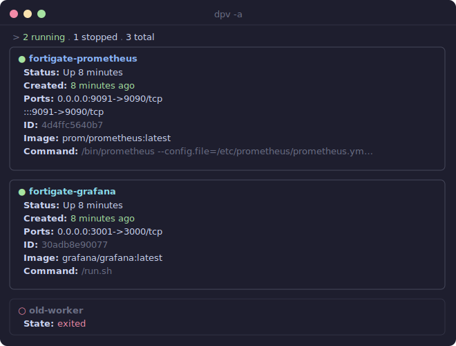
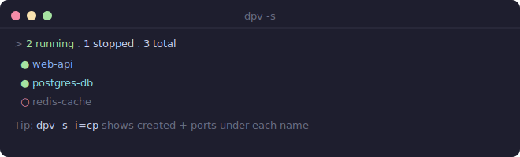

# dpv — Docker Pretty View

```
 ██████╗ ██████╗ ██╗   ██╗
 ██╔══██╗██╔══██╗██║   ██║
 ██║  ██║██████╔╝██║   ██║
 ██║  ██║██╔═══╝ ╚██╗ ██╔╝
 ██████╔╝██║      ╚████╔╝
 ╚═════╝ ╚═╝       ╚═══╝
```

**A prettier `docker ps`**, built in Go.

Tired of squinting at the super-wide `docker ps` output? `dpv` gives you a vertical, colored, card-based view of your containers — with status dots, age coloring, health indicators, and more.

Inspired by [docker-pretty-ps](https://github.com/politeauthority/docker-pretty-ps), rewritten from scratch in Go with a proper architecture and modern terminal styling.

## Why dpv?

| | `docker ps` | `docker-pretty-ps` | **`dpv`** |
|---|---|---|---|
| Output | Wide table, hard to read | Vertical, colored | **Bordered cards, status dots, age colors** |
| Data source | — | Parses `docker ps` text (fragile) | **Docker Engine SDK (structured API)** |
| Install | Built-in | `pip install` + Python runtime | **Single binary, zero dependencies** |
| Health checks | Shows in status string | No support | **First-class `--include h` flag** |
| Cross-platform | Yes | Python required | **Pre-built binaries for Linux/macOS/Windows** |

## Install

### go install (recommended)

Requires Go 1.25+. Installs the latest released version directly to `$GOPATH/bin`:

```bash
go install github.com/kumarasakti/dpv@latest
```

Install a specific version:

```bash
go install github.com/kumarasakti/dpv@v0.1.0
```

### Pre-built binaries

Download the binary for your platform from the [Releases](https://github.com/kumarasakti/dpv/releases) page, then move it to a directory in your `$PATH`:

```bash
# example for Linux amd64
curl -Lo dpv https://github.com/kumarasakti/dpv/releases/latest/download/dpv-linux-amd64
chmod +x dpv && sudo mv dpv /usr/local/bin/
```

### Build from source

```bash
git clone https://github.com/kumarasakti/dpv.git
cd dpv
make build
# binary is at ./bin/dpv
```

## Usage

```bash
# Show all running containers (default)
dpv

# Include stopped containers
dpv -a

# Search by container name (comma-separated)
dpv web,api

# Slim mode — just names with status dots
dpv -s

# Slim mode with specific fields
dpv -s -i=cp    # show created + ports

# JSON output
dpv -j

# Sort by name, reversed
dpv -o name -r
```

## Output Modes

### Pretty (default)

Each container is rendered as a bordered card. Long values (commands, ports) are
automatically truncated to fit your terminal width.



- `●` green dot = running, `○` red dot = stopped
- Created time is color-coded: **green** (<1h), **yellow** (<24h), **dim** (older)
- Long `Command` values are truncated with `…` to keep cards tidy

### Slim (`-s`)

Minimal status-dot + name list. Add `-i` to show selected fields inline.



Add fields with `-i`: `dpv -s -i=cp` shows created + ports under each name.

### JSON (`-j`)

```json
{
  "total_containers": 4,
  "total_running": 3,
  "containers": [
    {
      "id": "abc123def456",
      "name": "my-web",
      "image": "nginx:latest",
      ...
    }
  ]
}
```

## Flags

| Flag | Short | Description |
|---|---|---|
| `--all` | `-a` | Include stopped containers |
| `--slim` | `-s` | Minimal output with status dots |
| `--include` | `-i` | Columns: `(n)` id, `(i)` image, `(m)` command, `(c)` created, `(s)` status, `(p)` ports, `(h)` health |
| `--order` | `-o` | Sort by: `name`, `created`, `status` (default) |
| `--reverse` | `-r` | Reverse sort order |
| `--json` | `-j` | Output as JSON |
| `--version` | `-v` | Show version banner |

### Include shorthand examples

```bash
dpv -s -i=cp     # created + ports
dpv -s -i=ns     # container ID + status
dpv -i=cph       # created + ports + health (full card mode)
```

## Architecture

```
dpv/
├── main.go                     # Entry point
├── cmd/root.go                 # Cobra CLI, flags, wiring
├── internal/
│   ├── docker/
│   │   ├── client.go           # ContainerLister interface + Docker SDK impl
│   │   └── types.go            # Container, Port, Stats types
│   ├── filter/filter.go        # Search, running-only, sort, reverse
│   ├── formatter/
│   │   ├── formatter.go        # Formatter interface + summary bar
│   │   ├── pretty.go           # Bordered card output
│   │   ├── slim.go             # Minimal dot + name output
│   │   └── json.go             # JSON output
│   └── color/color.go          # Palette, status dots, age styling
└── Makefile
```

Key design decisions:
- **`ContainerLister` interface** — the Docker client is abstracted behind an interface, so all business logic is unit-testable with mocks (no Docker daemon needed for tests).
- **`Formatter` interface** — each output mode implements `Format(w, containers, stats)`. Adding a new format (YAML, table, etc.) is one file with zero changes to existing code.
- **Docker Engine SDK** (`github.com/moby/moby/client` v0.5.0) — structured API data, no fragile text parsing.

## Development

```bash
make build       # Build for current OS/arch → bin/dpv
make test        # Run tests with race detector
make lint        # Run golangci-lint
make install     # Install to $GOPATH/bin
make release     # Cross-compile for linux/darwin/windows (amd64 + arm64)
```

## License

MIT
